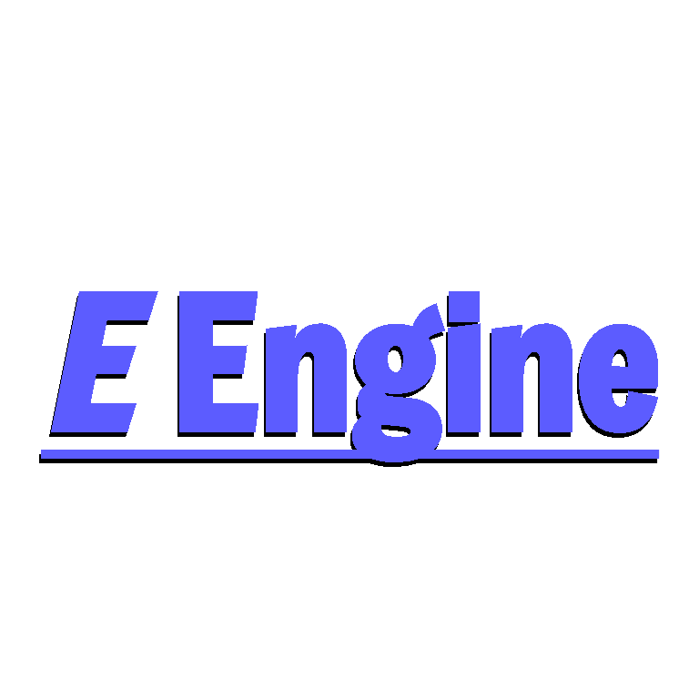

# EEngine

## Description
EEngine is a game engine built using OpenGL, designed to make a game called [TBD] with a focus on high-quality game play while keeping the nostalgia on the top.

## Features
- **Static Props:** Support for static objects in the game world.
- **Dynamic Props:** Ability to handle dynamic objects within the scene.
- **Skybox:** Rendering of skybox to enhance the environment.
- **Model Loading:** Capability to load 3D models into the engine.
- **Free Camera:** Includes a free camera for flexible navigation and scene exploration.

## Dependencies
- GLFW
- GLAD
- GLM
- Dear ImGui (ImGui)
- STB Image (stbi)
- JSON for Modern C++

## Roadmap
- [ ] Add map editor to the game.

## Contributing
Contributions are welcome! If permission is given, contributors can participate in the development, make changes, or publish project derivatives under the [Apache License 2.0](#license).

## License
This project is licensed under the Apache License 2.0. See [LICENSE](#license) for more details.

## Contact
- **Discord:** *etka06*
- **Email:** *etkaaga@gmail.com*
